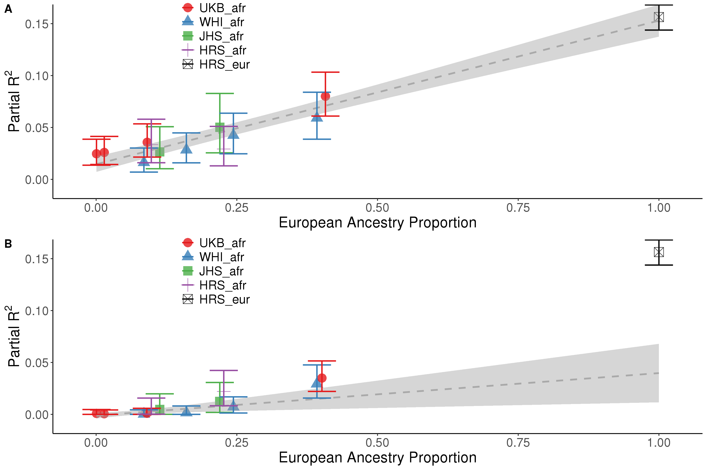

# Polygenic scores for height in admixed populations

[Link to manuscript](https://www.biorxiv.org/content/10.1101/2020.04.08.030361v2)

## Contents

# Table of contents
1. [Introduction](#intro)
2. [Understand subdirectories](#subdirectories-in-this-repository)
3. [Clone this repo and recreate analyses](#recreating-all-analyses-in-the paper.)
	1. [Prerequisites](#prerequisites)
	1. [Preparing input data](#prepare-genotype-input-data)
	2. [C+T and PRS](#get-data-ready-for-clumping/pruning)
	3. [LDpred](#ldpred-analyses)
	4. [PRS incorporating local ancestry]()
	5. [Stratified PRS by bins of recombination rate]()
	6. [Effect size vs frequencies across ancestries]()
	7. [PCA and GWAS in the UKB indivudals with admixed African ancestry]()
4. [Skip details. Take me to the scripts to recreate tables and figures in the paper](#make-all-figures-and-supplementary-tables-in-the-paper)

## Intro

Height is a very polygenic trait and well-studied in humans. GWAS summary statistics for height used hundreds of thousands of individuals of European ancestry. It is unclear how well polygenic risk scores (PRS) predict height in non-Europeans in comparison to Europeans. Here we explore and quantify this, and then provide improvements.




# Subdirectories in this repository

Within each dataset's directory you will find a README.md.

-[input](input_files/README.md): where modified input files are stored.

-[gwas](gwas/README.md): analysis of predictive power of height PRS using UK Biobank GWAS summary statistics.

-[sib_betas](sib_betas/README.md): analysis of predictive power of height PRS using effect sizes estimated from pairs of white British sibblings from the UK Biobank.

-[strat_prs](strat_prs/README.md): analysis of predictive power of PRS as a function of recombination rates of SNPs.

-[loc_anc_analysis](loc_anc_analysis/README.md): analyses using local ancestry in the PRS.

-[unweighted_prs](unweighted_prs/README.md): analysis using an unweighted version of the PRS calculation, where effect sizes are ignored and replaced by +1 or -1 (for positive and negative effects, respectively)

-[random_effect_prs](random_effect_prs/README.md): PRS without effect size or signal (only adding variants)

-[PCA_and_GWAS](PCA_and_GWAS/README.md):PCA analysis of UKB_afr and GWAS for height in UKB_afr_imputed (subdirectory)

-[ldpred](ldpred/README.md): analyses with LDpred1 for comparison with C+T

-[imputed](imputed/README.md): analyses with imputed genotype files when available (HRS, UKB)

Note: This will be updated as needed.

## Recreating all analyses in the paper.

### Prerequisites

*R and packages listed in the scripts.
*shell
*python (for ldpred1 analyses)
*ldpred
*PLINK and PLINK2
*bcftools
*there is an assumption that you have access to the datasets used in this paper. We are not allowed to share the raw data.


Go to a direcotry in your computer and clone this repo:

```
git clone https://github.com/mathilab/Height_Prediction_PRS.git
#from now on it is assumed your project root directory is called "Height_Prediction_PRS".
```

### Prepare genotype input data

Go to the [input directory](input/README.md) and follow instructions. 

Within each dataset's directory you will find a README.md with instructions on how to prepare input data. 

**Note: if you do get access to the data you will need to fix the path to the data accordingly. 

### Get data ready for clumping/pruning

Pruning/clumping using both the GWAS effect sizes ('gwas') and the sibling-estimated effect sizes ('sib_betas'). In both cases, p-values used for clumping come from the full UKB GWAS.

```
for D in JHS WHI ukb_afr ukb_eur HRS_eur HRS_afr;  #for each dataset
do
for F in sib_betas gwas;
do
Rscript --vanilla scripts/make_vcf.R temp $F $D
done
done
```
### Prune/clump using different methods and combine results

```
for D in JHS WHI ukb_afr ukb_eur HRS_eur HRS_afr;
do
for F in sib_betas gwas;
do
scripts/LD_prun.bash $F $D
done
done
for D in JHS WHI ukb_afr ukb_eur HRS_eur HRS_afr;
do
for F in sib_betas gwas;
do
scripts/combine_Rds_v2.sh $F $D
done
done
```

### Run polygenic scores
Now we are ready to calculate polygenic risk scores for each set of SNPs (gwas, sib_betas and unweighted_prs which, as the name suggest, is the unweighted version of the PRS):

```
for D in JHS WHI ukb_afr ukb_eur HRS_eur HRS_afr;
do
for F in sib_betas gwas;
do
scripts/calc_PGS.sh $F $D
unweighted_prs/calc_PGS.sh F $D
done
done
```


### Combine PRS results

Combine all PRS results per dataset:
```
for D in JHS WHI ukb_afr ukb_eur HRS_eur HRS_afr;
do
for F in gwas sib_betas unweighted_prs;
do 
rm $F/${D}/scripts/test2.txt;
rm $F/${D}/scripts/run_this_PGS.sh;
scripts/combine_Rds_PGS.sh $F $D
scripts/combine_Rds_PGS.sh gwas $D
unweighted_prs/combine_Rds_PGS.sh unweighted_prs $D #need to fix this
done
done

```


### LDpred analyses

See [README.md in the ldpred directory](ldpred/README.md)


### Plots

These scripts will produce plots for each pruning/clumping strategy. Throughout the paper we show the one called "phys_100000_0.0005":

```
for J in gwas sib_betas unweighted_prs;
do
Rscript --vanilla ${J}/WHI/scripts/Plots_WHI.R
Rscript --vanilla ${J}/JHS/scripts/Plots_JHS.R
Rscript --vanilla ${J}/ukb_afr/scripts/Plots_ukb_afr.R
Rscript --vanilla ${J}/ukb_eur/scripts/Plots_ukb_eur.R
Rscript --vanilla ${J}/HRS_afr/scripts/Plots_HRS_afr.R
Rscript --vanilla ${J}/HRS_eur/scripts/Plots_HRS_eur.R
done
for J in gwas sib_betas;
do
Rscript --vanilla scripts/combine_datasets.R ${J
done
Rscript --vanilla unweighted_prs/combine_datasets.R
```
##

## Make all figures and supplementary tables in the paper

```
Rscript --vanilla scripts/Fig1.R
Rscript --vanilla scripts/Fig2.R
Rscript --vanilla scripts/Fig3.R
Rscript --vanilla scripts/Fig4.R
Rscript --vanilla scripts/Fig5.R
Rscript --vanilla scripts/make_all_tables.R
```


